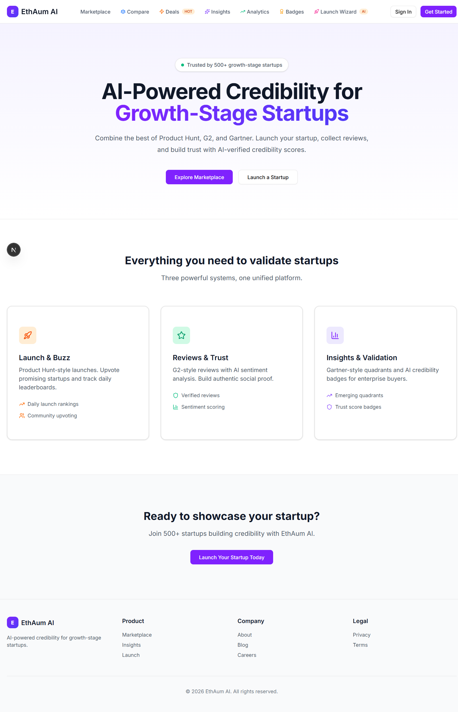
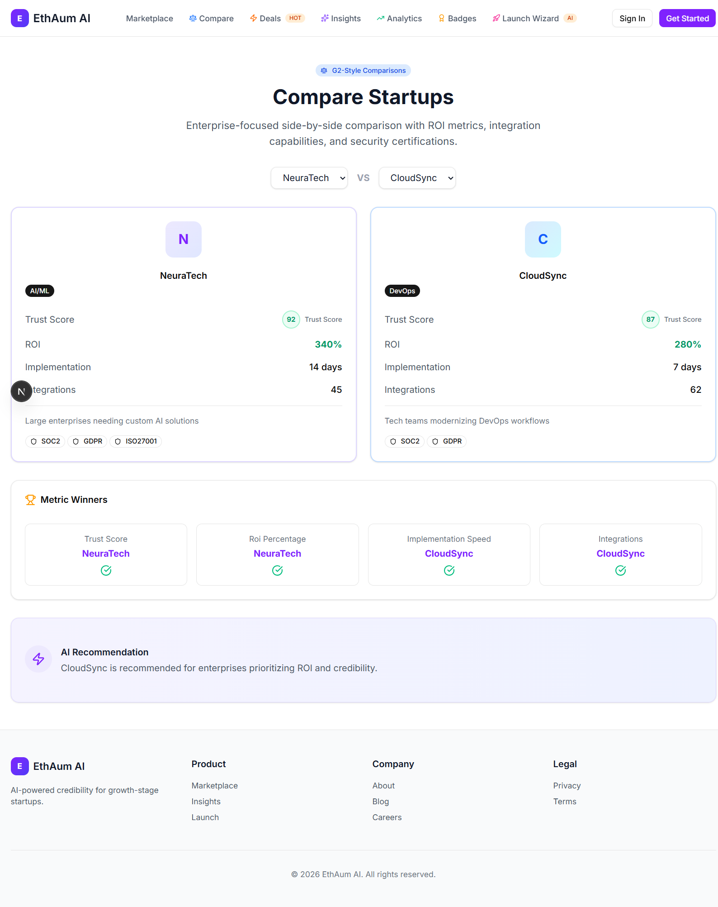
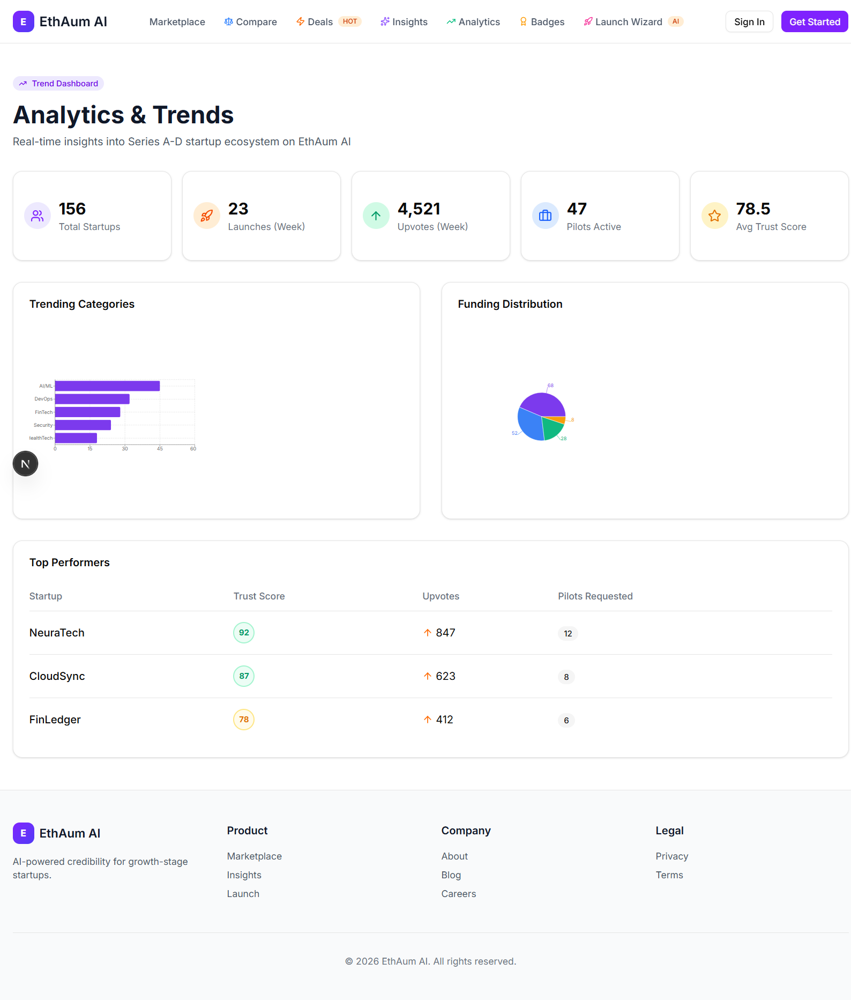
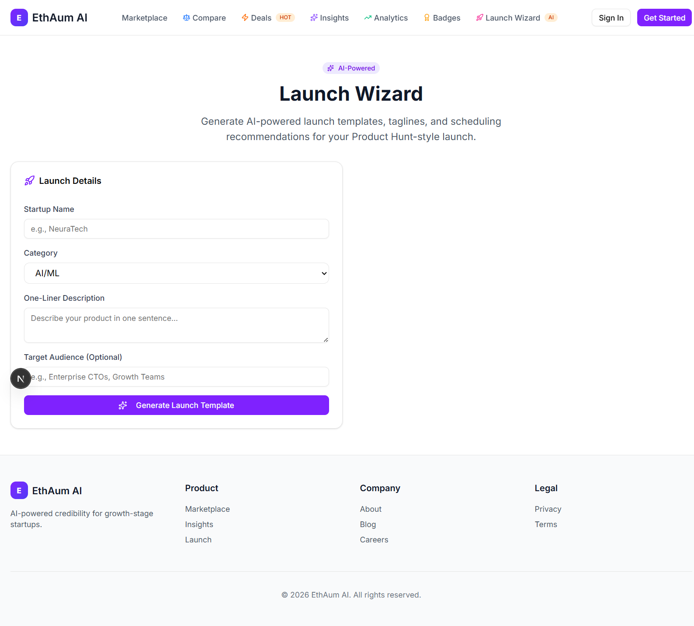
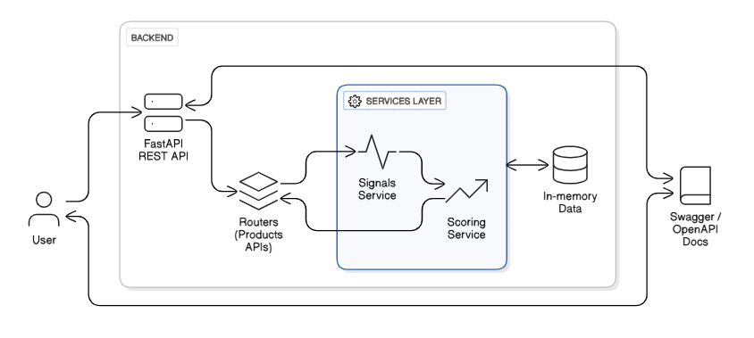

# EthAum AI

**AI-Powered SaaS Marketplace for Series A-D Startups**

Combining the capabilities of Product Hunt + G2 + Gartner + AppSumo into one unified platform with AI-powered credibility scoring and enterprise matchmaking.

## 🚀 Live Demo

| Component | URL |
|-----------|-----|
| **Frontend** | [https://ethaumai.vercel.app](https://ethaumai.vercel.app) |
| **Backend API** | [https://ethaum-venture-partners.onrender.com](https://ethaum-venture-partners.onrender.com) |
| **API Docs** | [https://ethaum-venture-partners.onrender.com/docs](https://ethaum-venture-partners.onrender.com/docs) |

> ⚠️ **Note:** Backend may take ~30 seconds to wake up on first request (free tier cold start).

## 🎥 Demo Video

[](https://youtu.be/KPuu3hIaQIY)

---


## 📸 Screenshots

### Homepage


### G2-Style Comparisons


### AppSumo-Style Deals


### Analytics Dashboard


### AI Launch Wizard


---

## 🏗️ Architecture



---

## 🎯 Problem Statement

Series A-D startups ($1M-$50M ARR) face:
- **High CAC**: Enterprise acquisition costs are unsustainable
- **Trust Gap**: No unified credibility scoring system
- **Fragmented Tools**: Need 4+ platforms (Product Hunt, G2, Gartner, AppSumo)
- **Slow Sales Cycles**: Enterprise deals take 6-12 months

## 💡 Solution: EthAum AI

A one-stop marketplace that:
- **Reduces marketing spend by 80-90%** through organic virality
- **Accelerates enterprise deals** via AI matchmaking and credibility scores
- **Provides embeddable trust badges** for startup websites
- **Offers data-driven insights** without analyst fees

---

## ✨ Features

### 🚀 Product Hunt-Style Launches
- Upvote system with leaderboard
- **AI Launch Wizard** with tagline generation and scheduling recommendations
- Featured badges for top launches

### ⭐ G2-Style Reviews & Comparisons
- Review submission with AI sentiment analysis
- **Side-by-side startup comparisons** with ROI metrics
- **Embeddable credibility badges** with copy-paste embed codes

### 📊 Gartner-Style Insights
- **Emerging Quadrant** visualization (Leaders, Challengers, Visionaries, Niche)
- **Analytics dashboard** with trends and funding distribution
- AI-generated credibility scores

### 💼 AppSumo-Style Deals
- Enterprise pilot programs with credibility backing
- **AI Matchmaking** - recommends enterprise buyers to startups
- Low-risk trial periods (30-60 days)

---

## 🧠 AI Components

### 1. Trust Score Algorithm
```
Trust Score = (Data Integrity × 0.40) + (Market Traction × 0.35) + (User Sentiment × 0.25)
```
- **Data Integrity**: Domain age, team size, funding verification
- **Market Traction**: Revenue, customer count, growth rate
- **User Sentiment**: Review ratings, sentiment analysis

### 2. AI Matchmaking
```
Match Score = Category Match (40) + Trust Score (30) + Market Traction (30)
```
Recommends enterprise buyer personas based on startup profile.

### 3. Launch Template Generator
Pattern-based AI generates:
- Tagline options
- Description templates
- Optimal launch timing (Tuesday 00:01 PST recommended)
- Asset checklists

---

## 🛠️ Tech Stack

| Layer | Technology |
|-------|------------|
| **Frontend** | Next.js 14, TypeScript, Tailwind CSS, shadcn/ui, Recharts |
| **Backend** | FastAPI (Python), Pydantic |
| **Database** | PostgreSQL (Supabase) |
| **Authentication** | Clerk (with Supabase user sync) |
| **Deployment** | Vercel (Frontend), Render (Backend) |

---

## 🔐 Phase 2 Features

- **User Authentication** - Sign up/Sign in with Clerk
- **Submit Startup** - Founders can add their own products
- **My Products** - Dashboard to manage your startups
- **Write Reviews** - Star ratings with sentiment analysis
- **Upvote System** - Vote for products (1 per user)
- **Leaderboard** - See top voted products
- **Launch Page** - Add products to leaderboard

---

## 🚀 Getting Started

### Prerequisites
- Node.js 18+
- Python 3.10+

### Installation

```bash
# Clone the repository
git clone https://github.com/Prakhar2025/EthAum-Venture-Partners.git
cd EthAum-Venture-Partners/ethaum-ai

# Backend setup
cd backend
pip install -r requirements.txt
uvicorn main:app --reload --port 8000

# Frontend setup (new terminal)
cd frontend
npm install
npm run dev
```

### Access
- **Frontend**: http://localhost:3000
- **Backend API**: http://localhost:8000
- **API Docs**: http://localhost:8000/docs

---

## 📁 Project Structure

```
ethaum-ai/
├── backend/
│   ├── main.py              # FastAPI entry point
│   ├── routers/
│   │   ├── products.py      # Product CRUD
│   │   ├── launches.py      # Upvotes & leaderboard
│   │   ├── reviews.py       # Sentiment scoring
│   │   ├── insights.py      # Quadrant data
│   │   ├── deals.py         # Enterprise pilots
│   │   ├── matchmaking.py   # AI buyer matching
│   │   ├── comparisons.py   # G2-style compare
│   │   ├── badges.py        # Embeddable widgets
│   │   ├── templates.py     # AI launch templates
│   │   └── analytics.py     # Trend dashboard
│   ├── services/
│   │   ├── scoring.py       # Trust score algorithm
│   │   └── matchmaking.py   # Matchmaking heuristics
│   └── schemas/
│       └── deal.py          # Pydantic models
├── frontend/
│   └── src/
│       ├── app/             # Next.js pages
│       ├── components/      # Reusable UI components
│       └── lib/             # API utilities
└── docs/
    ├── architecture.png     # System architecture
    └── screenshots/         # UI screenshots
```

---

## 🔌 API Endpoints

| Endpoint | Method | Description |
|----------|--------|-------------|
| `/api/v1/products` | GET/POST | Product management |
| `/api/v1/launches/leaderboard` | GET | Top launched products |
| `/api/v1/launches/{id}/upvote` | POST | Upvote a product |
| `/api/v1/reviews/{product_id}` | GET/POST | Reviews with sentiment |
| `/api/v1/insights/quadrant` | GET | Gartner-style quadrant |
| `/api/v1/deals` | GET | Enterprise pilot offers |
| `/api/v1/deals/request` | POST | Request a pilot |
| `/api/v1/matchmaking/{id}` | GET | AI buyer recommendations |
| `/api/v1/comparisons/{id1}/vs/{id2}` | GET | Compare two startups |
| `/api/v1/badges/{id}` | GET | Embeddable badge codes |
| `/api/v1/badges/{id}/preview` | GET | Visual badge preview |
| `/api/v1/templates/generate` | POST | AI launch templates |
| `/api/v1/analytics/dashboard` | GET | Trend analytics |

---

## 📱 Pages

| Page | Route | Description |
|------|-------|-------------|
| Home | `/` | Landing page |
| Marketplace | `/marketplace` | Browse all startups |
| Product Detail | `/product/[id]` | Details + AI matchmaking + Reviews |
| Compare | `/compare` | Side-by-side comparison |
| Deals | `/deals` | Enterprise pilot offers |
| Insights | `/insights` | Gartner quadrant |
| Analytics | `/analytics` | Trend dashboard |
| Badges | `/badges` | Embeddable widgets |
| Launch Wizard | `/wizard` | AI template generator |
| Launch | `/launch` | Submit product to leaderboard |
| Leaderboard | `/leaderboard` | Top products by upvotes |
| Submit Startup | `/submit` | Add your startup |
| My Products | `/my-products` | Manage your startups |

---

## 👥 Team

Built for EthAum Venture Partners Hackathon 2026

---

## 📄 License

MIT License
